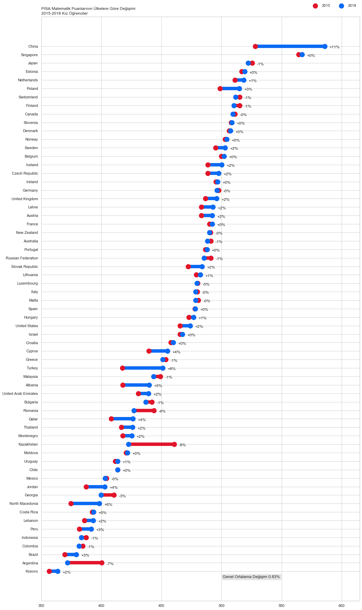
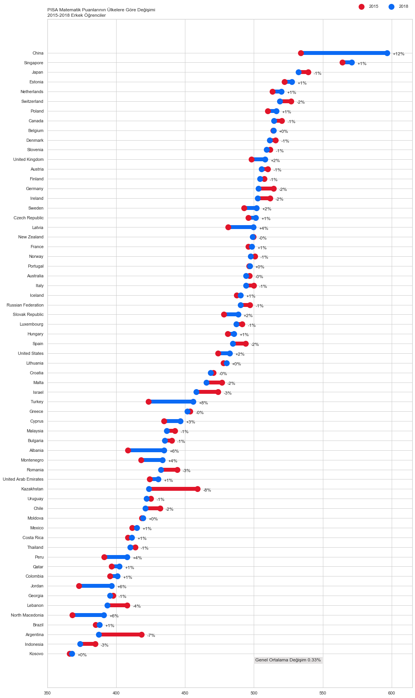

---
authors:
- admin
categories: [Veri Görselleştirme]
date: "2020-05-08T00:00:00Z"
draft: false
featured: false
image:
  caption: ""
  focal_point: ""
lastMod: "2020-05-08T00:00:00Z"
projects: []
subtitle: 
summary: 2015 ve 2018 Verilerinin Değerlendirilmesi
tags: [pisa, matematik başarısı, pisa2018, pisa2015, veri görselleştirme, python, matplotlib, seaborn, pandas]
title: Python ile PISA Matematik Puanlarının Değişimi Grafiği
---


Merhaba,   

Bu yazımda Python kullanarak PISA Matematik Puan Ortalamalarının 2015-2018 arasında cinsiyete göre nasıl bir değişim gösterdiğini grafikleyeceğiz. 

Bu yazıda elde edeceğimiz grafikler ulusal veya uluslararası raporlarda sıklıkla görebileceğiniz bir türden. Ülke ülke cinsiyete göre nasıl bir değişim olmuş onları göstereceğim. Değişimlerde bir azalma olursa yanı 2015'ten 2018'e bir azalma olursa kırmızı ile, bir artma olursa mavi çizgi ile belirteceğim. Böylece sadece renklere bakarak artış ya da azalışlar hemen farkedilebilir olacaktır ki veri görselleştirmenin en önemli amaçlarından birisi de budur. Ancak bununla da kalmayacağız ve yüzde olarak ne kadar bir fark olmuş onu da belirteceğim.  Gelin "veriyi konuşturalım". 


## Verilerin Elde Edilmesi

Verileri [Dünya Bankası](https://datacatalog.worldbank.org/) sayfasından 6 mayıs 2020 tarihinde aldım. 269 ülkeden oluşan veride ben sadece 2015 ve 2018 verileri olanları aldım ve diğerlerini eledim. Veride 2003,2006, 2009, 2012 yıllarına ait PISA verileri de vardı ancak onları bu çalışmada kullanmadım. İsteyen onlarla da çalışabilir. 


## Kullanılan Python Kütüphaneleri

Python ile veri görselleştirme yapılırken ben **matplotlib**, ve **seaborn** kütüphanelerini kullandım. İstenilirse **plotly** ile de grafikler çizilebilir. Veri analizinde ise **pandas** ve **numpy** kullandım. 


## Python Kodları

İlk olarak kütüphaneleri çağırarak işe başlıyorum. **import** komutu ile kullandığım paketleri **as** kullanarak da kısaltmalarını belirleyerek işleme başlıyorum. 


```python
import numpy as np
import pandas as pd
import matplotlib.pyplot as plt
import seaborn as sns
sns.set(style="whitegrid")  # grafikler için beyaz zemin oluşturma.

```


Kullanacağım kütüphaneleri yükledikten sonra verileri **pandas** kullanarak Github sitesinden çekiyorum. Bunun için

```bach
pandas.read_csv()
```
fonksiyounu kullandım. Hem kızlar hem erkekler için iki ayrı veri setini *kız* ve *erkek* nesnesine kaydedip 2018-2015 yılı arasındaki artışı görmek adına veriye *fark* değişkenini de ekleyeceğim.  Hem kız hem de erkek verilerini aşağıda görebilirsiniz. 


```python
kız = pd.read_csv('https://raw.githubusercontent.com/rnzbrk/R-files-/master/pisafemale.csv', sep=";")
kız = kız.set_index("Country").sort_values("2018")
kız["fark"] = kız["2018"] / kız["2015"] - 1
kız
```


<div>
<style scoped>
    .dataframe tbody tr th:only-of-type {
        vertical-align: middle;
    }

    .dataframe tbody tr th {
        vertical-align: top;
    }

    .dataframe thead th {
        text-align: right;
    }
</style>
<table border="1" class="dataframe">
  <thead>
    <tr style="text-align: right;">
      <th></th>
      <th>2015</th>
      <th>2018</th>
      <th>fark</th>
    </tr>
    <tr>
      <th>Country</th>
      <th></th>
      <th></th>
      <th></th>
    </tr>
  </thead>
  <tbody>
    <tr>
      <th>Kosovo</th>
      <td>356.729450</td>
      <td>363.776533</td>
      <td>0.019755</td>
    </tr>
    <tr>
      <th>Argentina</th>
      <td>400.443116</td>
      <td>371.848368</td>
      <td>-0.071408</td>
    </tr>
    <tr>
      <th>Brazil</th>
      <td>369.549307</td>
      <td>379.269456</td>
      <td>0.026303</td>
    </tr>
    <tr>
      <th>Colombia</th>
      <td>384.488336</td>
      <td>381.365275</td>
      <td>-0.008123</td>
    </tr>
    <tr>
      <th>Indonesia</th>
      <td>387.444975</td>
      <td>383.446725</td>
      <td>-0.010320</td>
    </tr>
    <tr>
      <th>...</th>
      <td>...</td>
      <td>...</td>
      <td>...</td>
    </tr>
    <tr>
      <th>Netherlands</th>
      <td>511.015941</td>
      <td>518.547572</td>
      <td>0.014739</td>
    </tr>
    <tr>
      <th>Estonia</th>
      <td>516.872753</td>
      <td>519.187027</td>
      <td>0.004477</td>
    </tr>
    <tr>
      <th>Japan</th>
      <td>525.495995</td>
      <td>522.034617</td>
      <td>-0.006587</td>
    </tr>
    <tr>
      <th>Singapore</th>
      <td>564.254534</td>
      <td>566.893619</td>
      <td>0.004677</td>
    </tr>
    <tr>
      <th>China</th>
      <td>528.194648</td>
      <td>585.753111</td>
      <td>0.108972</td>
    </tr>
  </tbody>
</table>
<p>63 rows × 3 columns</p>
</div>


```python
erkek = pd.read_csv('https://raw.githubusercontent.com/rnzbrk/R-files-/master/pisamale.csv', sep=";")
erkek = erkek.set_index("Country").sort_values("2018")
erkek["fark"] = erkek["2018"] / erkek["2015"] - 1
erkek
```


<div>
<style scoped>
    .dataframe tbody tr th:only-of-type {
        vertical-align: middle;
    }

    .dataframe tbody tr th {
        vertical-align: top;
    }

    .dataframe thead th {
        text-align: right;
    }
</style>
<table border="1" class="dataframe">
  <thead>
    <tr style="text-align: right;">
      <th></th>
      <th>2015</th>
      <th>2018</th>
      <th>fark</th>
    </tr>
    <tr>
      <th>Country</th>
      <th></th>
      <th></th>
      <th></th>
    </tr>
  </thead>
  <tbody>
    <tr>
      <th>Kosovo</th>
      <td>366.189422</td>
      <td>367.993933</td>
      <td>0.004928</td>
    </tr>
    <tr>
      <th>Indonesia</th>
      <td>384.779279</td>
      <td>373.734527</td>
      <td>-0.028704</td>
    </tr>
    <tr>
      <th>Argentina</th>
      <td>418.388361</td>
      <td>387.279360</td>
      <td>-0.074354</td>
    </tr>
    <tr>
      <th>Brazil</th>
      <td>385.040591</td>
      <td>387.871670</td>
      <td>0.007353</td>
    </tr>
    <tr>
      <th>North Macedonia</th>
      <td>368.237357</td>
      <td>390.933269</td>
      <td>0.061634</td>
    </tr>
    <tr>
      <th>...</th>
      <td>...</td>
      <td>...</td>
      <td>...</td>
    </tr>
    <tr>
      <th>Netherlands</th>
      <td>513.497847</td>
      <td>519.910895</td>
      <td>0.012489</td>
    </tr>
    <tr>
      <th>Estonia</th>
      <td>522.080414</td>
      <td>527.638015</td>
      <td>0.010645</td>
    </tr>
    <tr>
      <th>Japan</th>
      <td>539.267257</td>
      <td>532.156110</td>
      <td>-0.013187</td>
    </tr>
    <tr>
      <th>Singapore</th>
      <td>564.129004</td>
      <td>571.041480</td>
      <td>0.012253</td>
    </tr>
    <tr>
      <th>China</th>
      <td>534.010671</td>
      <td>596.553872</td>
      <td>0.117120</td>
    </tr>
  </tbody>
</table>
<p>63 rows × 3 columns</p>
</div>


İki yeni veri yarattım. *Fark1* ve *Fark2* verisi kızlarda ve erkeklerdeki Matematik puanlarının toplam değişim yüzdesini göstermekte. Bu iki ifadeyi text olarak her iki grafiğe ekleyip 2015-2018 arasında Matematik puanları genelinde nasıl bir durum oluşmuş onu görebiliriz. 

```python
Fark1 = str(round(kız['fark'].mean()*100, 2))
Fark2 = str(round(erkek['fark'].mean()*100, 2))

```


Grafiği çizerken hangi fonksiyonları kullandığımı kısaca burada anlatacağım

```bach
plt.figure # Grafiğin boyutunu belirler. 
y_range  # Y sütununda ülkeler olacak. Kaç ülke olacağını belirleyip ona göre bir ranj belirler
colors # np.where() komutu ile koşullu renklendirme yaptım. Eğer 2018 verisi 2015 verisinden büyük ise #0b6af4 değilse #E1152A kullanmasını istedim. 
plt.hlines # yatay çizği için kullanılan grafik fonksiyonu
plt.scatter # saçılım grafiği fonksiyonu. 2018 ve 2015'e ait verilerin saçılımını gösterir. 
plt.legend # legend yani tanımlama kutularının çizimi
plt.yticks # Y sütunundaki değişkenleri yerleştirme
plt.title #grafiğin başlığı
plt.xlim # x başlanğıç ve bitiş noktaları
plt.text # Fark1 ile hesapladığımız Matematik puanlarının toplam değişim yüzdesini belirtmek için kullanılır 

```


```python
plt.figure(figsize=(15,25))
y_range = np.arange(1, len(kız.index) + 1)
colors = np.where(kız['2018'] > kız['2015'], '#0b6af4', '#E1152A')
plt.hlines(y=y_range, xmin=kız['2015'], xmax=kız['2018'],
           color=colors, lw=10)
plt.scatter(kız['2015'], y_range, color='#E1152A', s=200, label='2015', zorder=3)
plt.scatter(kız['2018'], y_range, color='#0b6af4', s=200 , label='2018', zorder=3)
for (_, row), y in zip(kız.iterrows(), y_range):
    plt.annotate(f"{row['fark']:+.0%}", (max(row["2015"], row["2018"]) + 4, y - 0.25))
plt.legend(ncol=2, bbox_to_anchor=(1., 1.01), loc="lower right", frameon=False)
plt.yticks(y_range, kız.index)
plt.title("PISA Matematik Puanlarının Ülkelere Göre Değişimi\n2015-2018 Kız Öğrenciler", loc='left')
plt.xlim(350, 615)
plt.gcf().subplots_adjust(left=0.35)
plt.tight_layout()
plt.text(501,0.2,"Genel Ortalama Değişim " + Fark1+"%",bbox=dict(facecolor='#ccc9c9', alpha=0.5))
plt.show()
```





```python
plt.figure(figsize=(15,25))
y_range = np.arange(1, len(erkek.index) + 1)
colors = np.where(erkek['2018'] > erkek['2015'], '#0b6af4', '#E1152A')
plt.hlines(y=y_range, xmin=erkek['2015'], xmax=erkek['2018'],
           color=colors, lw=10)
plt.scatter(erkek['2015'], y_range, color='#E1152A', s=200, label='2015', zorder=3)
plt.scatter(erkek['2018'], y_range, color='#0b6af4', s=200 , label='2018', zorder=3)
for (_, row), y in zip(erkek.iterrows(), y_range):
    plt.annotate(f"{row['fark']:+.0%}", (max(row["2015"], row["2018"]) + 4, y - 0.25))
plt.legend(ncol=2, bbox_to_anchor=(1., 1.01), loc="lower right", frameon=False)
plt.yticks(y_range, erkek.index)
plt.title("PISA Matematik Puanlarının Ülkelere Göre Değişimi\n2015-2018 Erkek Öğrenciler", loc='left')
plt.xlim(350, 615)
plt.gcf().subplots_adjust(left=0.35)
plt.tight_layout()
plt.text(501,0.2,"Genel Ortalama Değişim " + Fark2+"%",bbox=dict(facecolor='#ccc9c9', alpha=0.5))
plt.show()
```





```python

```


## Grafiklerin ve Verinin Yorumlanması

İlk gözüme çarpan kızların  Matematik Puan ortalamalarının erkeklere göre daha fazla arttığıdır (Kız= %0,83; Erkek=%0,33). Türkiye verisine bakacak olursak kızlar ve erkeklerin %8 oranında arttığını görüyoruz. Birçok ülkede örneğin Kanada'da; kızların puanları değişmezken erkeklerin puanlarında bir gerilemenin olduğunu görebiliriz. Yorumlamalar size kalmış.


